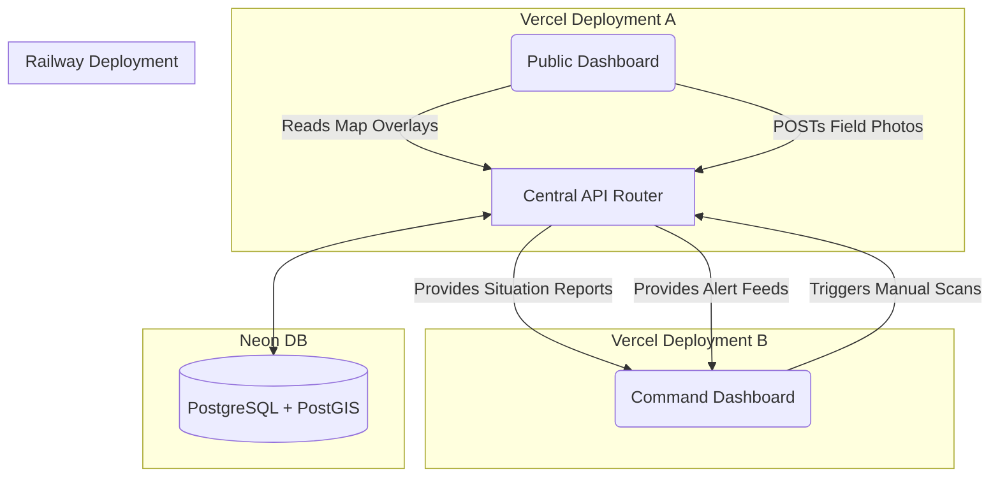

# SENTINEL Database Collaboration Guide

This document outlines the database architecture for the SENTINEL Disaster Management Platform. 

**TL;DR: DO NOT SET UP A SEPARATE DATABASE.** 
Both the Civilian/Public frontend and the Organization/Command frontend **MUST** read from the exact same Neon PostgreSQL database. This is critical because the data feeds into both sides:
- Civilians submit ground truth photos, which the Organization needs to see for cross-validation.
- The Organization triggers satellite processing, which the Civilian needs to view on the map.

---

## 1. The Single Source of Truth

We use a **Neon Serverless PostgreSQL Database** (with the PostGIS extension enabled for handling maps and geospatial data). 

The backend (FastAPI) acts as the bridge. **Neither frontend should ever connect to the database directly.** Both frontends should make HTTP requests to the centralized backend API (e.g. `http://localhost:8000/api/...`).

---

## 2. Core Tables and Usage

The schema is already completely designed and migrated. Here are the tables that matter most for the two different frontends:

### For the Civilian / Public Dashboard Developer:

You will mostly be interacting with these endpoints, backed by these tables:

1.  **`events`**: The list of active disasters (e.g. California Wildfire, Hokkaido Earthquake), populated automatically from GDACS/USGS.
    *   *Usage*: Rendering the map center and the basic event sidebar list.
2.  **`analyses`**: The processed satellite data. You don't need the heavy statistics, you just need the `damage_geojson` field to render the colored damage polygons on the Leaflet map.
3.  **`ground_reports`**: **Crucial for Civilians.** This is where public users upload photos from their phones via the PWA (Progressive Web App). You hit the `POST /api/ground-truth/submit` endpoint. The backend handles the AI damage classification and stores the R2 photo URL here.

### For the Organization / Command Dashboard Developer:

You will be viewing the heavy analytical tables via the backend:

1.  **`building_damage`**: Every individual structure that the satellite + AI determined was destroyed or damaged.
2.  **`infrastructure_risk`**: A filtered table of critical facilities (Hospitals, Power Stations, Bridges) that fall within danger zones.
3.  **`alert_log`**: System-generated alerts (e.g. "Severity Escalated", "High Dispute Density") where ground reports conflict with satellite data.
4.  **`analyses`**: Contains the full Groq (Llama) + Gemini Vision generated Situation Report payload, including recovery history timelines over multiple satellite passes.

---

## 3. How to Connect as a Collaborator

Since there is only one database, you need to share the environment variables. 

**Step 1:** The primary owner needs to create the free Neon database at neon.tech.
**Step 2:** The primary owner runs the `python terra/backend/db_setup.py` script once to build the tables.
**Step 3:** Share the `.env` file containing the `NEON_DATABASE_URL` with your collaborator.
**Step 4:** Both of you should point your local React setups to the same running backend API (`FRONTEND_URL=http://localhost:5173` locally, pointing to `BACKEND_URL=http://localhost:8000`).

When you deploy, you deploy **one** backend to to a provider like Railway, and **two** frontend deployments (or one combined frontend with routing logic) to Vercel. Both frontends will point their `BACKEND_URL` environment variable to the live Railway URL.

---

## 4. Visual Data Flow

